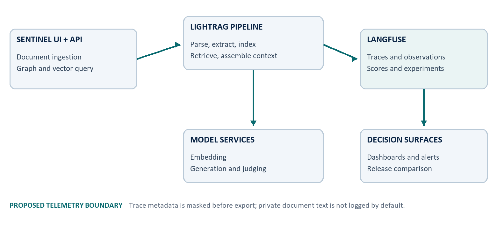
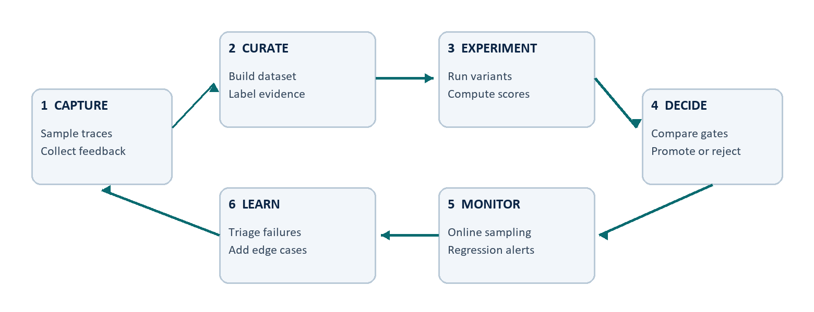

# Langfuse for Graph-RAG Operations: A Traceable Evaluation Blueprint for Sentinel RAG Ops

Harsh Chaudhary | 1 September 2026

Independent portfolio research design paper. Proposed Langfuse integration; not a benchmark report.

## Abstract

Graph-and-vector RAG systems can fail at ingestion, retrieval, context assembly, model invocation, or evaluation while still producing plausible outputs. This paper proposes a Langfuse-based observability and evaluation architecture for Sentinel RAG Ops, a LightRAG-derived document knowledge application.


## Research framing


### Problem statement

A RAG system can return a plausible answer even when retrieval was weak, context was truncated, a model call was throttled, or the answer was not supported by the selected evidence. Application uptime alone does not expose these failures. Sentinel RAG Ops already makes document status and graph state visible, but it does not yet provide a unified record of each retrieval and generation decision.

This paper proposes a Langfuse-based observability and evaluation layer for Sentinel RAG Ops. The design treats an ingestion job or user query as a trace, important pipeline steps as typed observations, and quality judgments as scores. It is a research design and implementation blueprint, not a report of a completed Langfuse deployment.


### Research questions

- **RQ1**: Which trace structure makes graph-and-vector RAG failures attributable to ingestion, retrieval, context assembly, or generation?

- **RQ2**: Which offline and online measures provide useful evidence of retrieval quality, answer grounding, latency, cost, and reliability?

- **RQ3**: How can telemetry remain diagnostically useful without copying private document content into an observability store by default?


### Contribution and scope

The contribution is a system-specific trace contract, evaluation protocol, release-gate strategy, and privacy boundary grounded in the existing Sentinel architecture and current Langfuse concepts. It does not introduce a new RAG algorithm, reproduce the LightRAG benchmark, or claim that observability alone improves answer quality.

Claim boundary: the existing project has historical evidence for one successful document workflow. All Langfuse traces, dashboards, experiments, and target metrics described here are proposed work.


## Foundations and system context

Retrieval-augmented generation combines model-based generation with information selected from an external collection [1]. LightRAG extends this pattern with graph structures, entity and relationship extraction, and dual-level retrieval [2]. Sentinel RAG Ops packages that engine behind a FastAPI service and a document, graph, and retrieval interface.


### Why observability is a separate engineering layer

An application log records events, but a RAG trace preserves causality across the user request, retrieval operation, selected context, model call, and result. Langfuse organizes individual observations into traces and can group traces into sessions [3]. Its typed observations include retriever, embedding, generation, evaluator, span, and event records [4].

| Layer | Existing Sentinel responsibility | Proposed Langfuse evidence |

| --- | --- | --- |

| Ingestion | Parse, chunk, extract, persist | Stage duration, status, counts, error class |

| Retrieval | Graph and vector evidence selection | Mode, top-k, source IDs, scores, latency |

| Generation | Keywords, extraction, final answer | Model, prompt version, usage, latency, error |

| Evaluation | Not yet systematic | Dataset run, deterministic checks, judge and human scores |

| Operations | Status UI and local logs | Versioned dashboards, release comparisons, alerts |


### Design principle

Stable semantic names should describe pipeline roles rather than model brands. Langfuse guidance notes that evaluators, dashboards, saved views, and experiments depend on consistent trace structure and meaningful inputs and outputs [5]. Model identifiers, retrieval mode, storage workspace, and software release belong in attributes rather than observation names.

Operational observability answers what happened and where. Evaluation asks whether the result was good enough. The two should share trace IDs but remain conceptually distinct.


## Proposed observability architecture


Figure 1. Proposed telemetry architecture. Langfuse is an observability and evaluation plane beside the existing RAG path; it is not in the answer-critical path.


### Placement and failure isolation

Instrumentation should surround existing LightRAG boundaries instead of replacing them. The application starts a root trace when an ingestion job or query begins. Child observations record parsing, embedding, graph extraction, retrieval, context assembly, generation, and evaluation. Telemetry export must be buffered and fail open: an unavailable observability backend should not block a document job or user answer.


### Identity and correlation

| Field | Proposed value | Reason |

| --- | --- | --- |

| trace name | rag.ingest or rag.query | Stable workload grouping |

| session ID | Conversation or batch identifier | Multi-turn and multi-document analysis |

| user ID | Pseudonymous internal identifier | Abuse, cost, and cohort analysis |

| release | Application build identifier | Regression comparison |

| tags | environment, route, experiment | Known-at-start segmentation |

| metadata | workspace hash, mode, top-k | Run-specific diagnostic context |

Langfuse is built on OpenTelemetry and can coexist with other telemetry destinations [3]. That makes a later infrastructure correlation path possible without forcing infrastructure-level spans into every LLM trace. Only observations needed to explain the RAG decision should be retained.


## Trace specification


### One trace per unit of work

The root observation should show the reviewable input and output: document metadata and terminal status for ingestion, or user question and final answer for a query. Each model invocation remains a separate generation observation so token use, latency, and failures are attributable [5].

| Trace | Child observation | Type | Minimum safe attributes |

| --- | --- | --- | --- |

| rag.ingest | parse_document | span | format, bytes, parser, status |

| rag.ingest | chunk_document | span | chunk policy, count, truncation |

| rag.ingest | embed_chunks | embedding | model, dimensions, batch size, usage |

| rag.ingest | extract_graph | generation | model, prompt version, entity and edge counts |

| rag.query | retrieve_context | retriever | mode, top-k, source hashes, retrieval scores |

| rag.query | assemble_context | span | selected count, context tokens, truncation |

| rag.query | generate_answer | generation | model, prompt version, usage, finish reason |

| rag.query | evaluate_answer | evaluator | metric version, score, rationale class |


### Naming and error taxonomy

Observation names remain stable across providers. Errors are normalized into parser_error, provider_auth, model_unavailable, rate_limited, storage_error, retrieval_empty, context_overflow, generation_error, and telemetry_error. Raw provider messages may be retained only after credential and content scrubbing.

```text
trace=rag.query > retrieve_context[retriever] > assemble_context[span] > generate_answer[generation] > evaluate_answer[evaluator]
```

Do not log full source chunks by default. Log source hashes, counts, score summaries, token totals, and a controlled redacted preview only when a research workspace explicitly allows it.


## Evaluation methodology


Figure 2. Proposed continuous evaluation loop. Production failures become curated test cases; offline experiments inform release decisions; online monitoring checks generalization.


### Offline and online evidence

Langfuse datasets and experiment runs can compare the same test items across prompt, model, retriever, and code variants; resulting judgments are stored as scores [6]. Online scores can then sample real traces and feed discovered edge cases back into the offline dataset. This closes the loop without treating production traffic as ground truth.

| Dimension | Primary measure | Evidence required |

| --- | --- | --- |

| Retrieval | Recall@k, MRR@k, context precision | Expected source or graded relevant passages |

| Grounding | Faithfulness / citation support | Answer claims aligned to retrieved evidence |

| Usefulness | Answer relevance and task success | Expected answer, rubric, or reviewer label |

| Efficiency | p50 and p95 latency, tokens, cost | Timestamp and generation usage attributes |

| Reliability | Success rate by normalized error class | Terminal trace status and release |

RAGAS separates context relevance, faithfulness, and answer relevance, illustrating why a single end-to-end score is insufficient [7]. Automated judges are useful for coverage but should be calibrated against human-reviewed samples and deterministic checks.


## Experimental protocol


### Dataset construction

Begin with a public, versioned corpus rather than private resumes. Create questions across direct facts, multi-hop relationships, summaries, unanswerable requests, contradictory sources, and prompt-injection attempts. Each item stores the question, expected source IDs, optional reference answer, task class, and difficulty. Split items into development and held-out evaluation sets before tuning.


### Controlled comparisons

| Factor | Candidate levels | Control rule |

| --- | --- | --- |

| Retrieval mode | naive, local, global, hybrid, mix | Same corpus, embedding space, model, and top-k |

| Context budget | small, medium, large | Same retrieval output and answer prompt |

| Prompt version | baseline and candidate | Same model, temperature, and evidence |

| Generation model | baseline and candidate | Same prompt, context, and decoding policy |


### Analysis plan

Run each deterministic configuration over the identical held-out items. Report per-item results, bootstrap confidence intervals, and paired differences rather than only averages. Segment by question class and inspect failures before selecting a winner. If model sampling is enabled, repeat runs and report variance.

- **Gate A**: No material regression in faithfulness or expected-source retrieval on the held-out set.

- **Gate B**: Latency and cost remain within a budget established from the baseline and user experience target.

- **Gate C**: Security cases do not expose hidden instructions, secrets, or unsupported source content.

Thresholds are deliberately not fabricated here. They should be fixed after a pilot, before the final comparison is run.


## Metrics, dashboards, and diagnosis

Langfuse metrics can aggregate quality scores, cost, latency, volume, tokens, and release dimensions [8]. A useful dashboard begins with decisions and failure modes, not every available field.

| Question | Dashboard slice | Diagnostic action |

| --- | --- | --- |

| Are answers becoming less grounded? | Faithfulness by release and retrieval mode | Inspect low-score traces and source selection |

| Why did latency move? | p50/p95 by observation and model | Separate retrieval, queue, and generation time |

| Where is cost concentrated? | Tokens and cost by route, model, workspace | Check context size, retries, and prompt changes |

| What fails in production? | Error rate by normalized class and release | Route to parser, provider, storage, or retrieval owner |

| Does a candidate generalize? | Offline run vs sampled online score distribution | Compare class coverage and drift |


### Alert design

Alerts should combine a meaningful threshold, minimum sample size, and time window. A single bad trace is a debugging case; a sustained rate change may be an incident. Separate availability alerts from quality monitors so a provider outage is not misclassified as an answer-quality regression.


### Trace-to-action examples

- **Empty retrieval**: Verify document completion, workspace identity, index version, mode, and top-k before changing the answer prompt.

- **High cost**: Compare context token growth, repeated model calls, retries, and prompt version at observation level.

- **Low faithfulness**: Inspect whether evidence was irrelevant, context was truncated, or generation ignored relevant passages.

A dashboard is not evidence of improvement. A release decision requires comparable runs, preserved configurations, and inspectable failures.


## Privacy, security, and governance


### Telemetry is another data destination

Sentinel can run locally while model calls and observability export leave the device. A trace may contain user questions, retrieved passages, prompts, answers, identifiers, and provider errors. Those fields can be as sensitive as the original document. Self-hosting changes operational control but does not remove the need for minimization, access control, backups, and retention policy.


### Proposed controls

- **Minimize**: Default to hashes, counts, model metadata, durations, and normalized errors; omit full chunks and prompts where they are not required.

- **Mask before export**: Redact credentials, email addresses, phone numbers, document paths, and configured sensitive patterns on the client side.

- **Separate environments**: Use distinct Langfuse projects or environments for development, evaluation, and production; never mix public benchmark data with private workspaces.

- **Restrict and expire**: Apply least-privilege access, retention limits, deletion procedures, and key rotation appropriate to the deployment.

- **Audit**: Sample traces for leakage, missing redaction, label quality, and evaluator drift before expanding capture.

Langfuse documents client-side masking as the option that prevents sensitive data from leaving the application and describes server-side ingestion masking as an additional self-hosted control [9]. For this project, client-side masking is the required first boundary.


### Threat-aware evaluation

The dataset should include malicious or misleading document instructions, cross-workspace retrieval attempts, secret-like strings, and unanswerable questions. Pass criteria must inspect both the final answer and the trace payload: a safe answer paired with leaked telemetry is still a failure.

Never store real API keys or private document text merely to make a trace look complete. Diagnostic value must be earned field by field.


## Implementation roadmap


### Phase 1 - trace without changing behavior

Add the Langfuse SDK behind a disabled-by-default configuration flag. Instrument one query and one ingestion path with stable names, terminal status, timing, and safe metadata. Flush telemetry asynchronously and confirm that export failure does not affect application results.


### Phase 2 - establish evaluation evidence

Create a small public dataset with expected source IDs and reviewer rubrics. Run the current configuration as the named baseline. Add deterministic retrieval and citation checks first, then calibrate model-based scores against a human-reviewed subset.


### Phase 3 - operationalize decisions

Add release and prompt version attributes, dashboards for latency, cost, quality, and errors, and a documented promotion checklist. Sample online traces and route failures into the dataset rather than continuously editing metrics to match observed behavior.

| Risk | Early signal | Mitigation |

| --- | --- | --- |

| Trace volume or cost grows | Unexpected span count or ingestion lag | Filter infrastructure noise; sample noncritical traces |

| Sensitive content appears | Audit finds raw PII or source text | Block export, strengthen client masking, delete affected data |

| Evaluator drift | Human agreement falls by class | Version judge prompts; recalibrate and retain human review |

| Instrumentation changes behavior | Latency or failure rate rises when enabled | Buffer export, time-box flush, fail open |


### Acceptance evidence

Completion requires trace examples for both success and failure, a privacy audit, a reproducible dataset run, baseline and candidate configurations, a short error analysis, and a release decision that cites measured tradeoffs. Screenshots alone are not sufficient.


## Limitations and conclusion


### Limitations

This design has not been executed against a live Langfuse instance. It therefore cannot report trace overhead, ingestion reliability, evaluator agreement, retrieval improvements, cost, or dashboard usefulness. Langfuse features and SDK contracts may change; implementation should follow the version installed at that time. Model-based evaluation can be biased, nondeterministic, and sensitive to the judge prompt. Human review remains necessary for calibration and high-risk cases.

The protocol also does not prove that the proposed metrics capture every user need. Recall@k requires meaningful relevance labels, faithfulness does not guarantee completeness, and a low-latency answer can still be wrong. Aggregate scores can hide rare but important failures, especially privacy breaches and cross-workspace retrieval.


### Conclusion

A credible RAG operations layer must connect each answer to the retrieval, context, model, version, and evaluation evidence that produced it. Langfuse provides a compatible trace, score, dataset, experiment, and metrics model for that work. The proposed design keeps the answer path owned by Sentinel and LightRAG while adding an inspectable evidence plane beside it.

The next milestone is intentionally small: instrument one public-data query path, verify privacy-safe trace structure, create a baseline dataset run, and publish measured results as a later empirical report. Until then, this paper is a transparent research blueprint rather than a performance claim.

Portfolio summary: designed a privacy-aware observability and evaluation architecture for a graph-and-vector RAG system, including trace contracts, experiment methodology, operational metrics, and release evidence.


## References and evidence status

[1] Lewis, P. et al. (2020). Retrieval-Augmented Generation for Knowledge-Intensive NLP Tasks. NeurIPS 2020. https://arxiv.org/abs/2005.11401

[2] Guo, Z., Xia, L., Yu, Y., Ao, T. and Huang, C. (2024; revised 2025). LightRAG: Simple and Fast Retrieval-Augmented Generation. https://arxiv.org/abs/2410.05779

[3] Langfuse. Observability data model: observations, traces, sessions, attributes, and OpenTelemetry. Accessed 1 September 2026. https://langfuse.com/docs/observability/data-model

[4] Langfuse. Observation types. Accessed 1 September 2026. https://langfuse.com/docs/observability/features/observation-types

[5] Langfuse. What does a good trace look like? Accessed 1 September 2026. https://langfuse.com/docs/observability/best-practices

[6] Langfuse. Evaluation core concepts. Accessed 1 September 2026. https://langfuse.com/docs/evaluation/core-concepts

[7] Es, S., James, J., Espinosa-Anke, L. and Schockaert, S. (2024). RAGAS: Automated Evaluation of Retrieval Augmented Generation. EACL 2024 Demo. https://arxiv.org/abs/2309.15217

[8] Langfuse. Metrics overview. Accessed 1 September 2026. https://langfuse.com/docs/metrics/overview

[9] Langfuse. Data masking for self-hosted deployments. Accessed 1 September 2026. https://langfuse.com/self-hosting/security/data-masking


### Project evidence status

Existing evidence: Sentinel RAG Ops architecture and one historical functional workflow documented in the companion technical case study. Proposed evidence: every Langfuse trace, score, dataset run, dashboard, alert, and promotion gate in this paper. No Langfuse credentials, telemetry, screenshots, or invented benchmark results are included.


### Attribution and paper status

Author and project owner: Harsh Chaudhary. Prepared with AI-assisted research and document production. This is an independent portfolio research design paper, not a peer-reviewed publication. Core graph-RAG functionality is attributed to LightRAG and its contributors; Langfuse capabilities are attributed to its documentation.