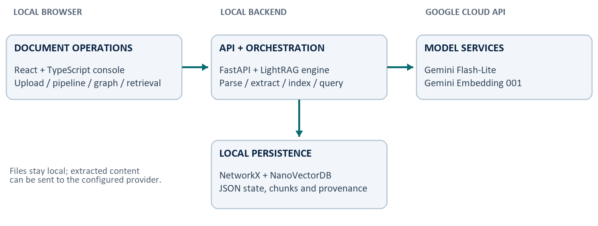
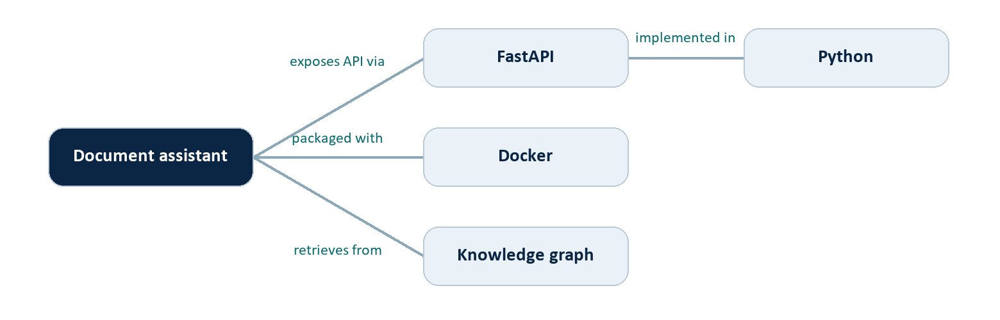

# Sentinel RAG Ops: From Documents to Connected Knowledge

Harsh Chaudhary | 30 August 2026

Portfolio technical report. Historical functional verification; not a comparative benchmark.


## Project overview


### The problem: documents contain facts, but not a usable knowledge interface

A document folder is easy to create and difficult to interrogate. Information may be distributed across paragraphs, tables and multiple files. A user often knows the question they want to ask but not the exact phrase or document location that contains the answer. Plain keyword search can miss paraphrases, while a general-purpose language model may answer without seeing the relevant private source.

Sentinel RAG Ops brings these steps into one local application: ingest a document, inspect processing status, create searchable representations, explore extracted relationships and retrieve evidence for a question. The intended experience is operational rather than conversational alone: users should be able to see whether a document was accepted, whether it finished processing, and whether its information reached the index.


### What RAG means in this project

Retrieval-augmented generation supplies a language model with information selected from an external collection. It separates the stored document collection from the model parameters; adding a file changes the searchable knowledge base rather than training a new model. The original RAG literature formalized the combination of retrieval and generation [1]. This project uses a graph-and-vector implementation derived from LightRAG [2].


### Scope and contribution

The case study covers product customization, local configuration, provider integration, document ingestion, graph inspection and functional verification. The existing LightRAG engine supplies the core extraction, graph construction and retrieval mechanisms. Sentinel RAG Ops presents a customized interface and operational setup around that foundation. The contribution described here is engineering integration and diagnosis, not a newly invented RAG algorithm.

The demonstrated deployment is a local prototype with cloud model calls. It is not an offline-only system, a public production deployment, or a completed comparison of retrieval methods. This distinction keeps the portfolio claim proportional to the available evidence.

Practical outcome: a document can move from upload to indexed knowledge, while its processing status and extracted relationships remain inspectable.


## System architecture

The application has four main boundaries: the browser interface, the Python API, external model services and local storage. Keeping these responsibilities separate makes it easier to diagnose whether a failure belongs to the file parser, model provider, indexing stage or visualization.


Figure 1. Logical architecture of the demonstrated configuration. Arrows indicate interaction, not an exhaustive network trace.

| Layer | Technology | Responsibility |

| --- | --- | --- |

| Web console | React, TypeScript, Vite | Document status, graph exploration and retrieval controls |

| HTTP API | FastAPI | Accept uploads, expose status and serve query endpoints |

| RAG engine | LightRAG Python package | Coordinate parsing, extraction, graph and vector retrieval |

| Model services | Google Gemini API | Generate text and compute embeddings |

| Graph / vectors | NetworkX / NanoVectorDB | Persist entity relationships and similarity indexes |

| Operational state | JSON-backed storage | Track documents, chunks, cache and provenance |


### Why the separation matters

A healthy API only proves that the server is reachable. It does not prove that credentials work, that every model is available, or that a document has been indexed. Likewise, a rendered graph is evidence of stored nodes and edges, not proof that every relationship is accurate. Each boundary therefore needs its own check.

The source retains the lightrag Python namespace and established configuration prefixes for compatibility. Branding changes do not require rewriting the functioning engine. The repository retains the upstream license and third-party notice [2, 6].


## From upload to searchable knowledge

Uploading is the start of a pipeline, not its final success condition. The server can accept a file before a downstream provider request fails. Users should therefore look for a completed processing status rather than treating an HTTP upload response as proof of a usable index.

- **Accept and track**: The API records the document and schedules processing. A document identifier and status make the background work visible to the interface.

- **Parse**: The selected parser extracts usable content. The documented test used native DOCX parsing. Other extensions are exposed by the active parser configuration, but were not all tested for this report.

- **Chunk and extract**: Content is divided into retrieval units. The extraction model identifies entities and relationships associated with source chunks. Tables and parsing options can affect the resulting chunk structure.

- **Persist and index**: The pipeline writes graph data, vector representations and source mappings. Embedding calls turn content into numerical representations for similarity search [3].

- **Complete or record an error**: A successful run is marked processed. A failure records a cause and can be retried through the supported pipeline action rather than by manually editing storage files.


### Model roles in the demonstrated configuration

| Role | Configuration |

| --- | --- |

| Extraction, keywords and answers | gemini-3.1-flash-lite |

| Text embeddings | gemini-embedding-001; 1,536 dimensions |

| Vision-language processing | Disabled in the documented test |

| Separate reranking model | Not configured |

These are configured roles, not four independently trained models. The same generation model can serve several roles. Credentials grant access to the provider API; they do not give Google direct access to arbitrary local files. The application chooses which extracted content to send.


## Why the knowledge graph is useful

Vector retrieval finds semantically similar content. A knowledge graph adds an explicit representation of entities and the relationships extracted between them. This can help organize questions involving several connected facts, although the benefit must be measured rather than assumed.


Figure 2. Illustrative entity relationships, not an export of the private test document.

In this example, a question about how an assistant is implemented can connect the application, its framework and its language. The graph is a map of extracted knowledge; the original source chunks remain necessary for checking evidence. An incorrect extraction can still produce a plausible-looking node or edge.

| Mode | Evidence selection | Useful starting point |

| --- | --- | --- |

| naive | Direct chunk-vector retrieval | Specific facts and source passages |

| local | Entity-focused graph context | Questions about a named entity |

| global | High-level relationship context | Broad themes and connections |

| hybrid | Local and global graph context | Entity detail plus wider relationships |

| mix | Graph context plus vector retrieval | Questions needing both evidence types |

Hybrid and Mix are not synonyms: Hybrid combines local and global graph retrieval, while Mix integrates graph and vector retrieval. These descriptions explain the available mechanisms; no winning mode is established by the single-document functional test.

The Knowledge Graph screen is an inspection tool. The Retrieval screen uses indexed evidence to support a response. Neither screen replaces source verification.


## Engineering case study: diagnosing failures

The development session exposed several failures that initially looked like an upload problem. Inspecting the failed document record isolated the actual stage and avoided unnecessary changes to the parser or document. The following is a chronological engineering account, not a controlled experiment.


### Provider setup and connection failures

The initial configuration still contained placeholder provider credentials and used an OpenAI-compatible setup. The file was accepted and parsed, but subsequent model calls could not complete. A socket-access restriction also affected an isolated diagnostic environment; permitting network access for that diagnostic allowed the provider check to run. Server availability and provider connectivity were separate questions.


### Model availability: HTTP 404

After Gemini was configured, the provider rejected gemini-2.5-flash for the account, returning a model-unavailable response. Updating the generation model removed that specific blocker. A valid key does not guarantee access to every model name, and model availability can change independently of the application.


### Account quota: HTTP 429

The next failure was RESOURCE_EXHAUSTED. The recorded response identified a free-tier limit of five generation requests per minute for gemini-3.6-flash in that project and suggested a delay of roughly 58 seconds. The document had reached seven processing chunks; several extraction calls were competing for the quota. That response concerned request rate, not the resume word count [4].


### Configuration change and successful retry

A minimal Flash-Lite generation test succeeded, and a separate embedding check returned a vector with 1,536 values. The configuration was changed to gemini-3.1-flash-lite, with MAX_ASYNC_LLM=1 and MAX_PARALLEL_INSERT=1. Old local server instances were stopped, one server was restarted, and the supported failed-document retry completed successfully.

Concurrency is not rate limiting. One request at a time can still exceed a per-minute or daily quota. The successful retry does not prove that concurrency alone solved the problem: the model and execution conditions also changed.


## What was verified

This report uses the dated development-session evidence from 29 August 2026. The application log was inspected again during report preparation on 30 August. The server was offline at that later inspection and the default index no longer contained the sample, so these measurements are historical observations, not a claim about a currently populated live deployment.

| Check | Observed result | What it establishes |

| --- | --- | --- |

| Document ingestion | One DOCX reached processed | The tested ingestion path completed |

| Final chunk count | 1 consolidated chunk | Final pipeline output for this retry |

| Graph write | 16 nodes; 15 edges | Graph construction and persistence occurred |

| Embedding diagnostic | 1 vector; 1,536 values | Configured embedding API returned data |

| Generation diagnostic | Minimal prompt returned OK | The selected generation model responded |

| Context-only retrieval | 4,556 characters; 1 reference | Source-backed context was returned |

| Graph interface | 16 nodes; 15 edges displayed | UI counts matched the recorded graph |


### Interpretation of the evidence

The retrieval check used a context-only request. It demonstrated retrieval of non-empty evidence with a document reference; it did not grade a final generated answer. The separate generation diagnostic established provider access, not answer faithfulness. Likewise, the graph counts describe the output size, not a manual audit of the extracted relationships.

The failed run showed seven chunks, whereas the completed retry showed one. That difference is another reason not to treat the before-and-after sequence as an isolated performance comparison. The report does not claim an accuracy improvement, speedup, lower cost percentage or statistically significant result.


### What remains untested

There is no completed multi-document benchmark, systematic retrieval-mode comparison, answer-quality score, exhaustive format test or public deployment load test. A single successful document is a useful functional milestone, but not evidence of production reliability across arbitrary documents.


## Using the application


### Start the installed local environment

From the repository folder, the following PowerShell command runs the already-installed environment. A fresh clone still requires the dependency and frontend build steps documented in the README. This report does not certify a fresh-clone installation on every operating system.

```text
.\.venv\Scripts\sentinel-rag-server.exe --host 127.0.0.1 --port 9621
```

Open http://127.0.0.1:9621/webui/ and keep the server process running. Restart the server after changing .env because the running process may otherwise retain old provider settings. Avoid launching multiple instances against the same default storage directory.


### Upload, inspect and query

- **Documents**: Upload a supported file and wait for Completed. If it fails, inspect the document error or pipeline detail before retrying. A larger word count is not automatically the cause.

- **Knowledge Graph**: Use the refresh control and select * for an overview. Search for an entity, select a node and inspect its properties and connections. Reset zoom if the graph is outside the visible area.

- **Retrieval**: Choose a mode, ask a question and check the supporting references. With no reranker configured, leave reranking disabled in the query settings.


### Questions that expose useful behavior

A factual question: "Which technologies are explicitly listed in this document?" A relationship question: "Which technologies are connected to each project?" A boundary question: "Does the document provide deployment costs? If not, say that the information is unavailable." These are demonstration prompts, not scored results.


### Understand the status before acting

No graph change may mean the document is still processing, the view needs refreshing, the current filter hides new entities, or matching entities were merged rather than duplicated. Distinguish an empty graph from a stale visualization by checking document completion and graph counts.

An API key for Gemini is different from LIGHTRAG_API_KEY. The first authorizes model calls; the second protects access to this application.


## Configuration and operational choices

The tested setup favors a small local deployment with straightforward persistence. The following settings describe the successful configuration, with all credentials intentionally omitted. Model availability and quota allowances should be checked for the account at the time of use.

```text
LLM_BINDING=gemini
LLM_BINDING_HOST=DEFAULT_GEMINI_ENDPOINT
LLM_MODEL=gemini-3.1-flash-lite
MAX_ASYNC_LLM=1

EMBEDDING_BINDING=gemini
EMBEDDING_BINDING_HOST=DEFAULT_GEMINI_ENDPOINT
EMBEDDING_MODEL=gemini-embedding-001
EMBEDDING_DIM=1536

MAX_PARALLEL_INSERT=1
RERANK_BINDING=null
```


### Why use separate generation and embedding models?

A generation model produces language and structured extraction output. An embedding model produces vectors used to rank semantically related content. One is not a replacement for the other. Matching vector dimensions is necessary, but dimensions alone do not define compatibility: changing the embedding model requires a separately rebuilt index in the new vector space [3].


### Why start with local file-backed storage?

NetworkX, NanoVectorDB and JSON-backed stores keep the initial deployment understandable and avoid requiring a separate database cluster. Their simplicity is useful for demonstration and diagnosis. It is not a claim that a file-backed single-process configuration is the right choice for every workload or many concurrent users.


### Why keep concurrency conservative?

A document can cause more than one provider call through extraction, follow-up extraction, keyword generation and final answering. Lower concurrency reduces bursts, but a robust quota strategy also needs pacing, provider-directed retry delays and explicit handling of daily exhaustion. Google documents request, token and daily limits separately, with limits applied at project level [4].


## Security, privacy and limitations


### Local hosting does not mean local inference

The browser and storage can run on the same computer while the backend sends extracted text to a cloud provider. Private resumes, internal reports and personal identifiers therefore need deliberate handling. The source document used during development is not reproduced here; the figures are conceptual and the measurements are sanitized.

Google lists different data-use terms for free and paid Gemini API tiers. Users should review the applicable terms before sending personal or confidential material [5]. A local model is an architectural alternative, not an offline configuration verified by this report.


### Protect credentials and exposure

Keep .env out of version control and do not show key values in screenshots, demos or logs. A key exposed during development should be revoked and replaced; this report contains no credentials and does not certify that account-level rotation has occurred. For a shared deployment, configure authentication before exposing the API beyond loopback, add HTTPS and limit origins as appropriate.


### Documents are evidence, not trusted instructions

Uploaded text may contain misleading claims or prompt-injection instructions. Retrieving a passage does not make it authoritative. Generated answers should remain grounded in the source, and the application should not treat document text as permission to execute commands, reveal credentials or take external actions. A systematic prompt-injection defense evaluation remains future work.


### Quality and deployment boundaries

Entity extraction can omit important facts, create duplicates or infer a relationship that is not supported. Parser behavior can vary across scanned PDFs, complex tables and image-heavy files. Provider quota and availability can interrupt otherwise valid requests. These risks motivate source inspection, explicit uncertainty and failure reporting rather than an unconditional promise of correct answers.

Public production readiness is not established. Before deployment, verify authentication, backups and restore, storage isolation, upload limits, dependency security, observability and workload-specific tests. A successful local demonstration does not replace these checks.


## Lessons learned and next steps


### What this project demonstrates

The project connects a document-management interface, an asynchronous Python service, generation and embedding APIs, graph construction and evidence retrieval. More importantly, the case study shows how to diagnose across those boundaries: inspect the failing stage, read the provider error, test components independently, then verify the pipeline after changing configuration.

Several lessons are transferable. An accepted upload can still fail downstream. A valid key can target an unavailable model. Concurrency controls do not guarantee compliance with rate limits. A graph view can be stale even when graph data exists. A retrieval response can be non-empty without proving that a final answer is correct.


### A practical improvement sequence

- **Measure retrieval quality**: Create a public document collection and question set with expected answers and evidence. Compare naive, hybrid and mix under the same model and context budget. Report errors and latency alongside correctness.

- **Make quota handling explicit**: Add request pacing and respect provider retry guidance. Keep retry attempts bounded and distinguish temporary throttling from daily quota exhaustion. This controller is proposed work, not an implemented result.

- **Strengthen traceability**: Capture sanitized per-stage timing, provider errors and source references. Use separate research and private-data workspaces so public experiments cannot leak personal content.

- **Validate deployment**: Test authentication, persistence after restart, backup recovery and representative file formats before exposing the system publicly.


### Conclusion

Sentinel RAG Ops is a practical engineering case study in making document knowledge accessible and inspectable. The documented milestone is successful DOCX ingestion, graph creation, embedding integration and source-backed context retrieval in a local setup. Its portfolio value lies in explaining the architecture and the diagnosis clearly, preserving upstream credit, and setting measurable next steps without overstating what one successful example proves.

Portfolio summary: customized and configured a LightRAG-based document knowledge application; investigated provider and quota failures; verified graph creation and evidence retrieval in a documented local case study.


## References and evidence notes

[1] Lewis, P. et al. (2020). Retrieval-Augmented Generation for Knowledge-Intensive NLP Tasks. https://arxiv.org/abs/2005.11401

[2] Guo, Z., Xia, L., Yu, Y., Ao, T. and Huang, C. (2024; revised 2025). LightRAG: Simple and Fast Retrieval-Augmented Generation. https://arxiv.org/abs/2410.05779

[3] Google AI for Developers. Gemini API: Embeddings. Accessed 30 August 2026. https://ai.google.dev/gemini-api/docs/embeddings

[4] Google AI for Developers. Gemini API: Rate limits. Accessed 30 August 2026. https://ai.google.dev/gemini-api/docs/rate-limits

[5] Google AI for Developers. Gemini Developer API pricing and tier data-use information. Accessed 30 August 2026. https://ai.google.dev/gemini-api/docs/pricing

[6] HKUDS. LightRAG source repository; see also LICENSE and THIRD_PARTY_NOTICES.md in the customized project. https://github.com/HKUDS/LightRAG


### Project evidence register

Source inspection: README.md, AGENTS.md, pyproject.toml, lightrag_webui/package.json, lightrag/api/lightrag_server.py, lightrag/llm/gemini.py and the graph/retrieval UI components. These establish documented architecture and available configuration, not exhaustive runtime validation.

Development evidence: provider diagnostic outputs and API/UI checks recorded on 29 August 2026. The application log at 20:27:27 records a graph with 16 nodes and 15 edges; at 20:27:29 it records processing completion. Context-only retrieval returned 4,556 characters and one reference. These are historical functional observations.

Preparation check: on 30 August the configured model identifiers were rechecked without printing credentials. The server was not reachable and the default document-status store was empty. No data was restored, re-uploaded or regenerated to create the report. Raw logs and the private source document are deliberately excluded.


### Attribution and report status

Project owner: Harsh Chaudhary. This is a portfolio technical report prepared with AI-assisted documentation, not a peer-reviewed publication. Core graph-RAG functionality is attributed to LightRAG and its contributors. Diagrams are explanatory illustrations. Future-work statements are not implementation claims.